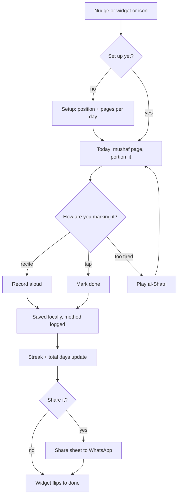

# App flow — Wird

Every path a real person can walk through this app. Read with `PROFILE.md`; where they
disagree, PROFILE.md wins and this file gets fixed.

## 1. Entry points

| Entry | Lands on | State they arrive in |
|---|---|---|
| App icon | Today | First run → Setup. Otherwise straight to today's portion. |
| Notification tap | Today | Deep-linked, portion already loaded |
| Home screen widget tap | Today | Same |
| Firebase App Distribution install | Setup | Brand new, no data |

There is no dashboard and no home screen. The app opens onto the thing you're supposed
to do. That is deliberate — a home screen is one more thing to get past on a day you
already don't feel like it.

## 2. The happy path

1. Nudge arrives, offset from a prayer time → user taps it
2. Today opens on the real mushaf page, today's portion lit, the rest of the page dimmed
3. User reads or recites → taps **Record** and recites aloud
4. Recording saves locally → day marked done, method logged as `recited`
5. Streak and total days read both tick up
6. Optionally: **Send to Ustadh** → Android share sheet → WhatsApp
7. Widget flips to done

**Done means:** a `DayEntry` exists for today with a status and a method, and the widget
reflects it.

## 3. Every screen

### Setup

- **Who reaches it:** first run only, and from Settings later
- **They see:** where are you now (surah + ayah, or page), and how much per day
- **They can:** set position → set target → land on Today
- **Empty:** this *is* the empty state
- **Error:** if the Quran.com API is unreachable, accept the position anyway and fetch
  the page when the network returns. Setup must never be blocked by the network.

### Today

- **They see, in order:** the mushaf page with today's portion lit and the rest dimmed;
  then the actions
- **They can:** Record · Mark done · Play al-Shatri · Read in Quran for Android · Recite
  in Tarteel · (after recording) Send to Ustadh
- **Empty:** never empty — there is always a today
- **Loading:** the page skeleton holds the mushaf's shape so the layout doesn't jump
- **Error:** page fetch failed → show the last cached page and a quiet retry. Never a
  blank screen.
- **Offline:** fully usable for any page already cached. Recording and marking done
  never need the network.

### Progress

- **They see:** streak, total days read, and the honest split — "22 marked, 4 recited"
- **They can:** go back to Today
- **Empty:** day one shows zeros plainly, with no encouragement copy. Sacred Rule 3.

### Recordings

- **They see:** what they've recited, newest first
- **They can:** play, share to WhatsApp, delete
- **Empty:** "Nothing recorded yet." No nudging.

### Notifications not arriving

- **Who reaches it:** the self-check finds a nudge didn't fire, or the user opens it from
  Settings
- **They see:** steps for *their* phone, by manufacturer
- **Offline:** fully static, works with no network

## 4. States that are not the happy path

- [ ] **First run, no data.** → Setup. One action: set your position.
- [ ] **Slow connection (3G).** Cached page renders immediately. An uncached page shows
      its skeleton and the font fetches in the background. Marking done never waits on
      the network.
- [ ] **Request failed.** Last cached page plus a quiet retry. Never a blank screen and
      never an error dialog blocking the core action.
- [ ] **Permission refused — notifications.** The app still works. The widget carries the
      nudge instead, and the app says so once, without nagging.
- [ ] **Permission refused — exact alarms (default on Android 14+).** Fall back to an
      inexact alarm, tell the user the timing will drift, and point at the widget.
- [ ] **Permission refused — microphone.** Recording is hidden, tap-to-mark still works,
      and the app explains why in one sentence.
- [ ] **Killed by the OEM mid-day.** The widget is the recovery path — it's rebuilt on
      the next update tick.
- [ ] **Double submit.** Two taps on Record or Mark done produce one `DayEntry` for the
      day, not two.
- [ ] **Midnight crossing while the app is open.** Today rolls over on next resume; a
      recording started before midnight belongs to the day it started.

## 5. Exits

| Exit | Trigger | What we keep |
|---|---|---|
| Marked done | Record or tap | `DayEntry`, recording, updated position |
| Left mid-recording | Backgrounded, call, kill | Partial audio discarded; the day stays unmarked. Never mark a day done on a partial. |
| Skipped the day | Midnight passes | Day logged as missed. Streak breaks; total days read does not. |
| Uninstall | — | Everything goes. Nothing is anywhere else. Export exists for exactly this. |

## 6. Flows explicitly not built

Mirrors NOT IN V1 in PROFILE.md.

- Browsing to an arbitrary page, because this is a habit tool, not a reader (Sacred Rule 5)
- Any sign-in or account, because nothing leaves the phone
- Correcting a recitation, because Tarteel does it better — link out
- Sharing progress publicly, because Sacred Rule 1 and Sacred Rule 3
