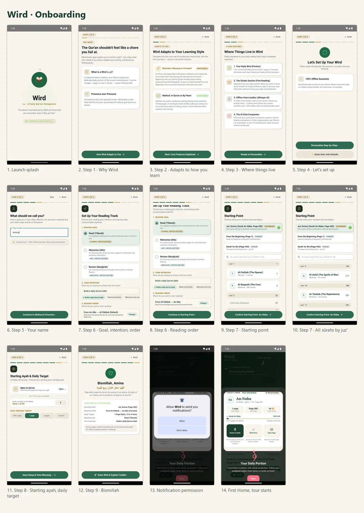
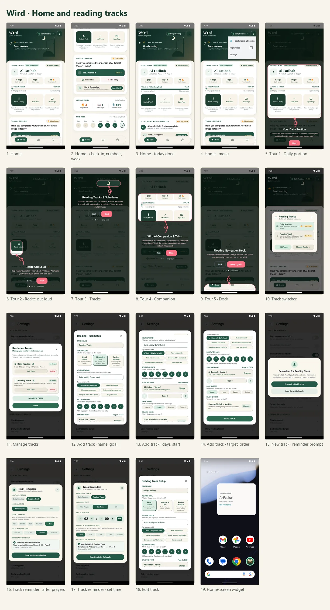
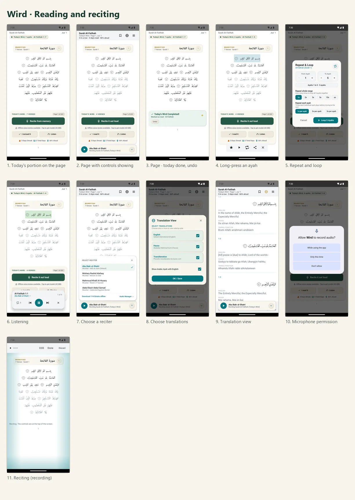
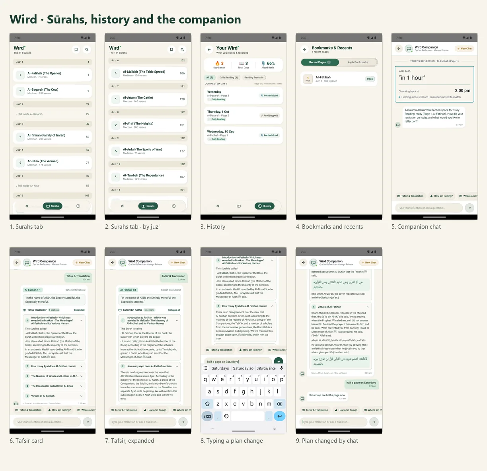
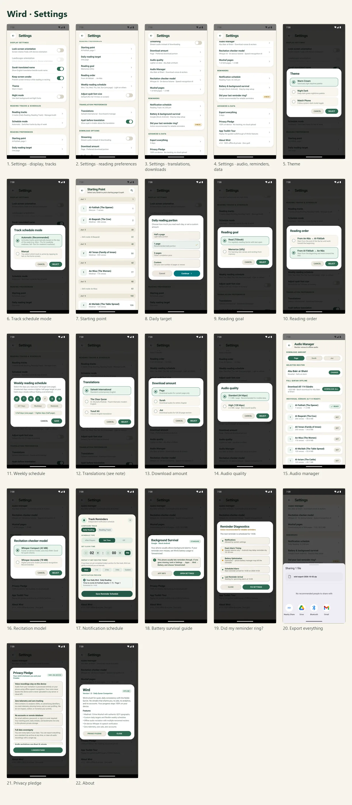

# Wird, screen by screen

Every screen in the app, in the order a new user meets them. Captured on 2026-10-03 from the
Android emulator (Pixel 6 Pro image) running the current `main` build, in light mode.

The streaks, days and the name "Amina" are demo data on the emulator, not anyone's real
record. Each section has one overview sheet and a folder with the full-size screens.

Known issues these screenshots show, still open as of 2026-10-03:

- **Settings → Translations** offers "The Clear Quran" and "Yusuf Ali". Neither is in the
  app, and the choice is saved but nothing reads it. The working translation picker is on
  the reading page.
- The tour, onboarding step 3 and step 4, and About still say the recitation check works
  "word-for-word" and "100% offline". It marks verses, and it needs a one-time model
  download.

## Onboarding

- [Launch splash](1-onboarding/01-launch-splash.webp)
- [Step 1 · Why Wird](1-onboarding/02-step-1-why-wird.webp)
- [Step 2 · Adapts to how you learn](1-onboarding/03-step-2-adapts-to-how-you-learn.webp)
- [Step 3 · Where things live](1-onboarding/04-step-3-where-things-live.webp)
- [Step 4 · Let's set up](1-onboarding/05-step-4-let-s-set-up.webp)
- [Step 5 · Your name](1-onboarding/06-step-5-your-name.webp)
- [Step 6 · Goal, intention, order](1-onboarding/07-step-6-goal-intention-order.webp)
- [Step 6 · Reading order](1-onboarding/08-step-6-reading-order.webp)
- [Step 7 · Starting point](1-onboarding/09-step-7-starting-point.webp)
- [Step 7 · All sūrahs by juz'](1-onboarding/10-step-7-all-surahs-by-juz.webp)
- [Step 8 · Starting ayah, daily target](1-onboarding/11-step-8-starting-ayah-daily-target.webp)
- [Step 9 · Bismillah](1-onboarding/12-step-9-bismillah.webp)
- [Notification permission](1-onboarding/13-notification-permission.webp)
- [First Home, tour starts](1-onboarding/14-first-home-tour-starts.webp)

## Home and reading tracks

- [Home](2-home-and-tracks/01-home.webp)
- [Home · check-in, numbers, week](2-home-and-tracks/02-home-check-in-numbers-week.webp)
- [Home · today done](2-home-and-tracks/03-home-today-done.webp)
- [Home · menu](2-home-and-tracks/04-home-menu.webp)
- [Tour 1 · Daily portion](2-home-and-tracks/05-tour-1-daily-portion.webp)
- [Tour 2 · Recite out loud](2-home-and-tracks/06-tour-2-recite-out-loud.webp)
- [Tour 3 · Tracks](2-home-and-tracks/07-tour-3-tracks.webp)
- [Tour 4 · Companion](2-home-and-tracks/08-tour-4-companion.webp)
- [Tour 5 · Dock](2-home-and-tracks/09-tour-5-dock.webp)
- [Track switcher](2-home-and-tracks/10-track-switcher.webp)
- [Manage tracks](2-home-and-tracks/11-manage-tracks.webp)
- [Add track · name, goal](2-home-and-tracks/12-add-track-name-goal.webp)
- [Add track · days, start](2-home-and-tracks/13-add-track-days-start.webp)
- [Add track · target, order](2-home-and-tracks/14-add-track-target-order.webp)
- [New track · reminder prompt](2-home-and-tracks/15-new-track-reminder-prompt.webp)
- [Track reminder · after prayers](2-home-and-tracks/16-track-reminder-after-prayers.webp)
- [Track reminder · set time](2-home-and-tracks/17-track-reminder-set-time.webp)
- [Edit track](2-home-and-tracks/18-edit-track.webp)
- [Home-screen widget](2-home-and-tracks/19-home-screen-widget.webp)

## Reading and reciting

- [Today's portion on the page](3-reading/01-today-s-portion-on-the-page.webp)
- [Page with controls showing](3-reading/02-page-with-controls-showing.webp)
- [Page · today done, undo](3-reading/03-page-today-done-undo.webp)
- [Long-press an ayah](3-reading/04-long-press-an-ayah.webp)
- [Repeat and loop](3-reading/05-repeat-and-loop.webp)
- [Listening](3-reading/06-listening.webp)
- [Choose a reciter](3-reading/07-choose-a-reciter.webp)
- [Choose translations](3-reading/08-choose-translations.webp)
- [Translation view](3-reading/09-translation-view.webp)
- [Microphone permission](3-reading/10-microphone-permission.webp)
- [Reciting (recording)](3-reading/11-reciting-recording.webp)

## Sūrahs, history and the companion

- [Sūrahs tab](4-surahs-history-companion/01-surahs-tab.webp)
- [Sūrahs tab · by juz'](4-surahs-history-companion/02-surahs-tab-by-juz.webp)
- [History](4-surahs-history-companion/03-history.webp)
- [Bookmarks and recents](4-surahs-history-companion/04-bookmarks-and-recents.webp)
- [Companion chat](4-surahs-history-companion/05-companion-chat.webp)
- [Tafsir card](4-surahs-history-companion/06-tafsir-card.webp)
- [Tafsir, expanded](4-surahs-history-companion/07-tafsir-expanded.webp)
- [Typing a plan change](4-surahs-history-companion/08-typing-a-plan-change.webp)
- [Plan changed by chat](4-surahs-history-companion/09-plan-changed-by-chat.webp)

## Settings

- [Settings · display, tracks](5-settings/01-settings-display-tracks.webp)
- [Settings · reading preferences](5-settings/02-settings-reading-preferences.webp)
- [Settings · translations, downloads](5-settings/03-settings-translations-downloads.webp)
- [Settings · audio, reminders, data](5-settings/04-settings-audio-reminders-data.webp)
- [Theme](5-settings/05-theme.webp)
- [Track schedule mode](5-settings/06-track-schedule-mode.webp)
- [Starting point](5-settings/07-starting-point.webp)
- [Daily target](5-settings/08-daily-target.webp)
- [Reading goal](5-settings/09-reading-goal.webp)
- [Reading order](5-settings/10-reading-order.webp)
- [Weekly schedule](5-settings/11-weekly-schedule.webp)
- [Translations (see note)](5-settings/12-translations-see-note.webp)
- [Download amount](5-settings/13-download-amount.webp)
- [Audio quality](5-settings/14-audio-quality.webp)
- [Audio manager](5-settings/15-audio-manager.webp)
- [Recitation model](5-settings/16-recitation-model.webp)
- [Notification schedule](5-settings/17-notification-schedule.webp)
- [Battery survival guide](5-settings/18-battery-survival-guide.webp)
- [Did my reminder ring?](5-settings/19-did-my-reminder-ring.webp)
- [Export everything](5-settings/20-export-everything.webp)
- [Privacy pledge](5-settings/21-privacy-pledge.webp)
- [About](5-settings/22-about.webp)
